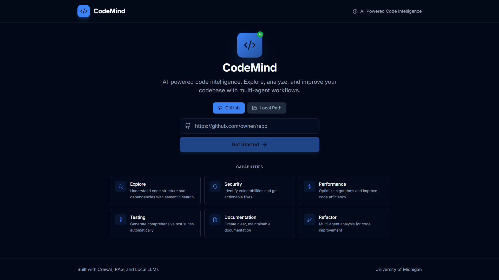
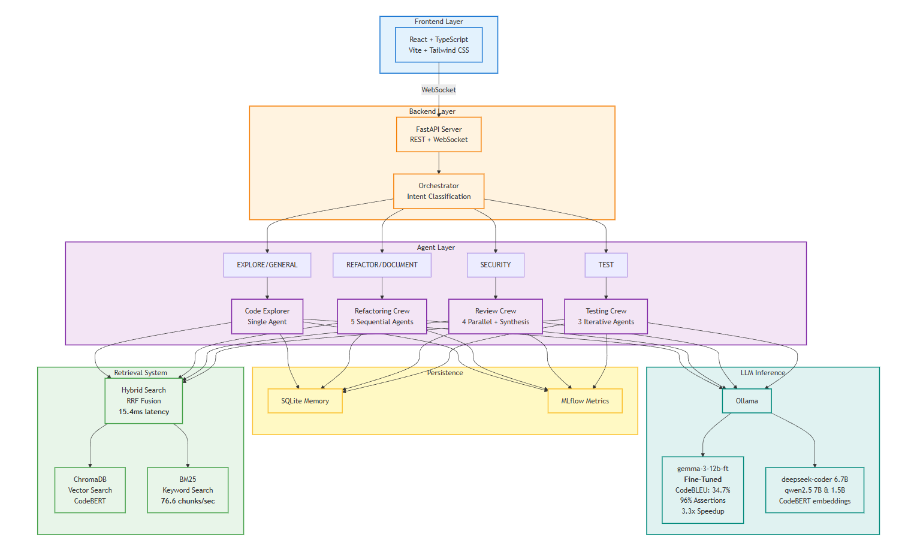

# CodeMind

**AI-powered code intelligence. Explore, analyze, and improve your codebase with multi-agent workflows.**

[](https://www.python.org/downloads/)
[](https://crewai.com/)

---



---

## The Problem

Understanding and improving large codebases is one of the most time-consuming challenges in software development. Developers spend countless hours navigating unfamiliar code, hunting for security vulnerabilities, writing test cases, and documenting systems they barely understand. Traditional tools offer static analysis, but they lack the contextual understanding that comes from truly comprehending what the code does and why.

CodeMind addresses this by bringing AI directly into your development workflow. Unlike cloud-based solutions that send your proprietary code to external servers, CodeMind runs entirely on your local hardware. Your code never leaves your machine.

---

## What CodeMind Does

CodeMind is a multi-agent AI system that understands your codebase at a semantic level. Point it at any repository, and within seconds it builds a searchable knowledge base of your code. From there, you can ask questions in natural language, request security audits, generate test suites, or get refactoring suggestions from a team of specialized AI agents working together.

The system combines two powerful paradigms: Retrieval-Augmented Generation (RAG) for accurate code search, and multi-agent collaboration for complex analysis tasks. When you ask a simple question, a single agent retrieves relevant code and answers directly. When you request a comprehensive security review, an entire crew of specialized agents collaborates to analyze your code from multiple perspectives.

---

## Architecture Overview

CodeMind follows a modular architecture with three main layers: a React frontend for user interaction, a FastAPI backend for orchestration and API management, and a multi-agent system powered by CrewAI and local LLMs via Ollama.



### The Data Flow

When a user submits a query, it travels through a carefully orchestrated pipeline:

1. **Intent Classification**: The Orchestrator agent analyzes the query to determine its purpose. Is the user exploring code, requesting tests, asking for a security review, or something else?

2. **Routing Decision**: Based on the classified intent, the system routes the query to either a single agent (for simple questions) or a multi-agent crew (for complex tasks).

3. **Context Retrieval**: The RAG system retrieves relevant code snippets using hybrid search, combining semantic understanding with keyword matching.

4. **Response Generation**: The selected agent or crew processes the query with the retrieved context and generates a response, streaming tokens back to the user in real-time.

5. **Memory Update**: The conversation is stored for context continuity, allowing follow-up questions and references to previous interactions.

---

## Capabilities

### Code Exploration

Ask questions about your codebase in natural language. CodeMind retrieves semantically relevant code and explains functionality, traces dependencies, identifies design patterns, and helps you understand unfamiliar systems.

- "What does the authentication middleware do?"
- "How are database connections managed?"
- "Explain the data flow from API to storage."

### Security Analysis

The Security Analyst agent examines code for vulnerabilities, following structured verification protocols to minimize false positives. It identifies issues like injection risks, hardcoded credentials, improper error handling, and insecure configurations.

- "Find security vulnerabilities in the user service."
- "Review the payment processing module for security issues."

### Performance Optimization

The Performance Engineer agent analyzes algorithms and data structures, identifying inefficiencies and suggesting optimizations. It examines time and space complexity, detects N+1 query patterns, and recommends caching strategies.

- "Optimize the search algorithm in utils.py"
- "Find performance bottlenecks in the data pipeline."

### Test Generation

The Testing Crew generates comprehensive test suites through an iterative process. It writes tests, executes them, analyzes failures, and refines until the tests pass or reach a maximum iteration count.

- "Generate unit tests for the Calculator class."
- "Write integration tests for the API endpoints."

### Documentation

The Documentation Writer agent creates clear, maintainable documentation based on actual code behavior. It generates docstrings, module overviews, and API documentation.

- "Document the configuration module."
- "Add docstrings to the data models."

### Refactoring

The Refactoring Crew provides a comprehensive analysis combining all specialists. Five agents collaborate sequentially: a Code Explorer understands the structure, a Security Analyst identifies risks, an Algorithm Optimizer suggests improvements, a Test Engineer recommends test coverage, and a Documentation Writer creates documentation.

---

## The Agent System

### Orchestrator

The Orchestrator is the central intelligence that classifies user intent and routes queries. It distinguishes between six intent categories:

| Intent | Description | Routing |
|--------|-------------|---------|
| EXPLORE | Code understanding, Q&A | Code Explorer (single agent) |
| REFACTOR | Code improvement requests | Refactoring Crew (5 agents) |
| TEST | Test generation requests | Testing Crew (3 agents) |
| SECURITY | Security analysis requests | Review Crew (5 agents) |
| DOCUMENT | Documentation requests | Refactoring Crew (documenter) |
| GENERAL | General conversation | Code Explorer |

### Code Explorer

The Code Explorer is a RAG-augmented agent for answering questions about code. It retrieves relevant chunks from the indexed codebase and synthesizes accurate, grounded responses. Anti-hallucination prompts ensure it only reports what exists in the actual code.

### Refactoring Crew

A sequential pipeline of five specialized agents:

```
Explorer --> Security --> Algorithm --> Tester --> Documenter
```

Each agent builds upon the analysis of the previous one, creating a comprehensive improvement plan. The crew operates in read-only mode, proposing changes rather than applying them directly.

### Code Review Crew

A parallel analysis system where four reviewers work simultaneously:

```
Security Analyst ----+
Performance Engineer-+---> Synthesis Agent ---> Final Report
Test Coverage -------+
Documentation -------+
```

The synthesis agent combines findings into a unified report, removing duplicates and verifying each finding against the actual code.

### Testing Crew

An iterative refinement loop:

```
Generate Tests --> Execute --> Analyze Failures --> Refine --> (repeat)
```

The crew continues iterating until all tests pass or a maximum iteration count is reached (default: 3 iterations).

---

## The RAG System

CodeMind uses a hybrid retrieval approach that combines the strengths of semantic and keyword search.

### Indexing

When you point CodeMind at a codebase, the indexer processes each file:

1. **AST Parsing**: Code is parsed into an Abstract Syntax Tree to identify semantic units (functions, classes, methods).

2. **Chunking**: Each semantic unit becomes a chunk with rich metadata: function name, parameters, return types, docstrings, line numbers, and complexity scores.

3. **Embedding**: Chunks are embedded using CodeBERT, a model specifically trained to understand code semantics.

4. **Storage**: Embeddings are stored in ChromaDB for vector search, while raw text is indexed in BM25 for keyword search.

### Retrieval

When a query arrives, the hybrid retriever executes two parallel searches:

1. **Vector Search**: ChromaDB finds chunks with similar semantic meaning, even if they use different terminology.

2. **BM25 Search**: Keyword matching finds chunks containing exact terms, important for function names and identifiers.

### Fusion

Results are combined using Reciprocal Rank Fusion (RRF):

```
RRF_score = sum(1 / (k + rank_i)) for each ranking
```

This formula rewards chunks that rank highly in both searches while avoiding over-reliance on either method. The default fusion constant (k=60) is tuned for code retrieval.

### Optional Reranking

For maximum precision, an optional cross-encoder reranker can re-score the top candidates, though this adds latency.

---

## Technology Stack

### Backend

| Component | Technology | Purpose |
|-----------|------------|---------|
| Web Framework | FastAPI | REST and WebSocket endpoints |
| Real-time | WebSockets | Streaming responses, progress updates |
| Multi-Agent | CrewAI | Agent coordination and task execution |
| Agent Utilities | LangChain | Tool integration, prompt management |
| LLM Inference | Ollama | Local model hosting |
| Vector Database | ChromaDB | Semantic code search |
| Embeddings | sentence-transformers | CodeBERT for code understanding |
| Keyword Search | rank-bm25 | BM25 algorithm implementation |
| Code Parsing | tree-sitter | JavaScript/TypeScript AST parsing |
| Observability | MLflow | Metrics tracking, experiment logging |
| Persistence | SQLite | Conversation memory |

### Frontend

| Component | Technology | Purpose |
|-----------|------------|---------|
| Framework | React 18 | Component-based UI |
| Language | TypeScript | Type safety |
| Build Tool | Vite | Fast development and bundling |
| Styling | Tailwind CSS | Utility-first CSS |
| Components | shadcn/ui | Accessible component primitives |
| Icons | Lucide React | Consistent iconography |

### LLM Models

CodeMind uses Ollama to run models locally:

| Model | Size | Purpose |
|-------|------|---------|
| deepseek-coder | 6.7B | Code generation, explanation |
| qwen2.5 | 7B | Orchestration, planning |
| qwen2.5 | 1.5B | Lightweight classification |

### Embedding Models

| Model | Purpose |
|-------|---------|
| microsoft/codebert-base | Primary code embeddings |
| all-MiniLM-L6-v2 | Fallback (smaller, faster) |

---

## Performance

Benchmarked on an RTX 4080 (16GB VRAM):

| Metric | Target | Actual |
|--------|--------|--------|
| RAG Retrieval | < 500ms | ~47ms |
| Indexing Speed | - | 8.9 chunks/sec |
| Simple Query Response | < 3s | ~2-3s |
| Codebase Indexing (100 files) | < 30s | ~11s |

---

## Anti-Hallucination Measures

Large language models can generate plausible but incorrect information. CodeMind implements several safeguards:

1. **Structured Output Formats**: Agents follow strict templates that separate observations from conclusions.

2. **Code Inventory Steps**: Before making claims, agents must first list what code actually exists.

3. **Verification Checklists**: Each finding must be verified against actual code snippets.

4. **Evidence-Based Reporting**: Claims must be supported by specific line numbers and code references.

5. **Abstention Protocols**: When uncertain, agents are instructed to say "I don't know" rather than guess.

These measures significantly reduce false positives in security analysis and improve the accuracy of code explanations.

---

## System Requirements

- **Python**: 3.10 or higher
- **GPU**: NVIDIA RTX 3080 or better (12GB+ VRAM recommended)
- **RAM**: 16GB minimum, 32GB recommended
- **Storage**: 10GB for models and indices
- **Ollama**: Installed and running

---

## Acknowledgments

- [CrewAI](https://crewai.com/) for the multi-agent orchestration framework
- [Ollama](https://ollama.ai/) for making local LLM inference accessible
- [ChromaDB](https://www.trychroma.com/) for the vector database
- [Microsoft CodeBERT](https://github.com/microsoft/CodeBERT) for code-aware embeddings

---

*Built with CrewAI, RAG, and Local LLMs | University of Michigan*
